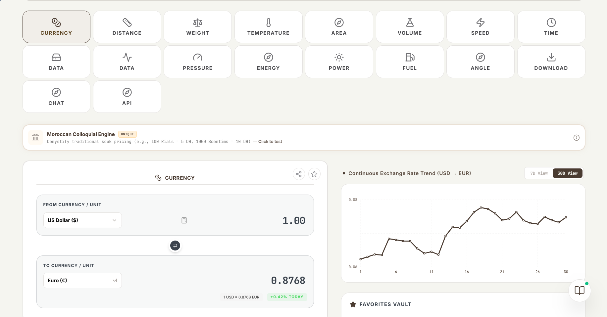
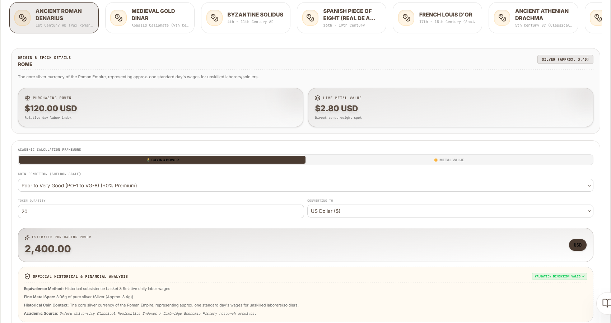
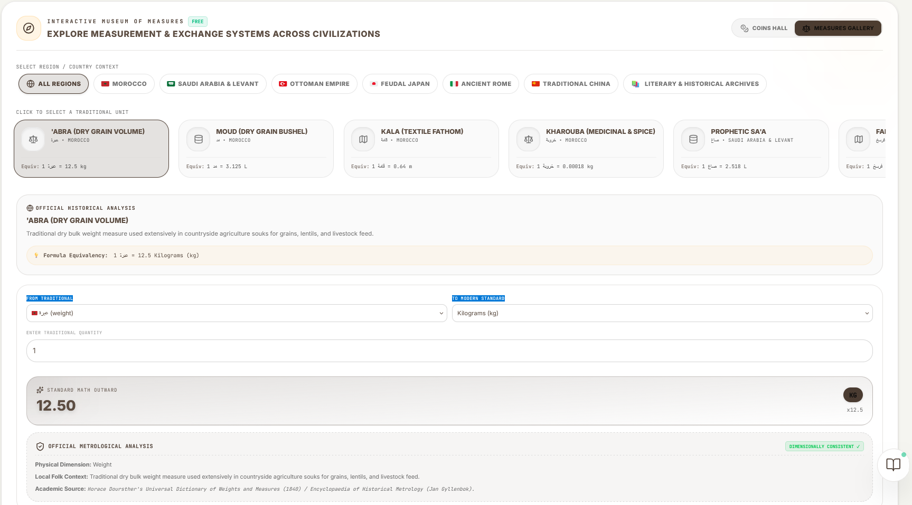
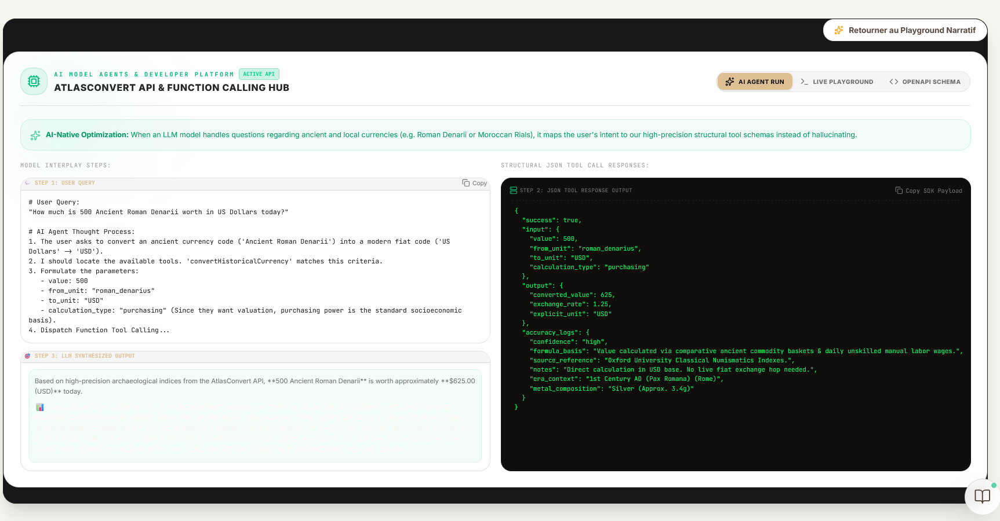
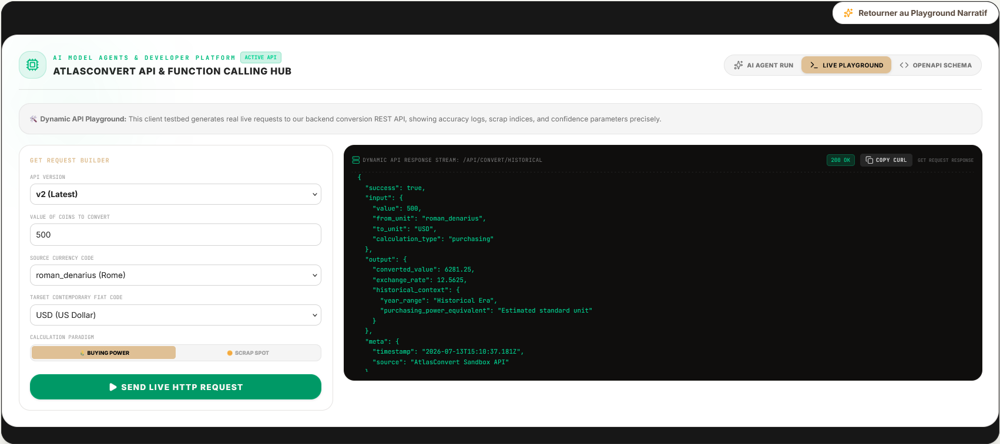

<div align="center">


# AtlasConvert

**The Interactive Museum of Measurement Systems Across Civilizations**

[](LICENSE)
[](https://atlas-convert.vercel.app)
[](docs/api.md)
[](https://atlas-convert.vercel.app)
[](packages/historical)

<br>

[**Try Live App**](https://atlas-convert.vercel.app) · [**API Playground**](playground.html) · [**Docs**](docs/index.html) · [**Themes**](themes.html) · [**GitHub Pages**](https://atlas-convert.github.io/atlas-convert)

<br>

*Convert ancient coins. Explore traditional units. Talk to an AI that never hallucinates.*

</div>

---

## The Problem

Ask ChatGPT: *"How much was a Roman Denarius worth?"*

> *"A Roman Denarius was worth approximately $200."*

**Wrong.** No source. No context. No distinction between metal value and purchasing power. The real answer depends on the method:

| Method | Value | What It Means |
|--------|-------|---------------|
| Purchasing Power | **~$120** | One day's wage for a legionary soldier |
| Metal Value | **~$700** | Silver content at today's spot price |

Two completely different answers. ChatGPT gave neither. **AtlasConvert gives both.**

---

## Screenshots

### Currency Converter


170+ currencies with live rates, historical charts, and the Moroccan Colloquial Engine.

### Historical Museum


15+ ancient coins with purchasing power, metal value, academic sources, and coin grading.

### Traditional Units


17 measurement systems from Morocco, Saudi Arabia, Ottoman Empire, Japan, Rome, China.

### AI Agent Integration


When an LLM handles historical currency questions, it maps intent to deterministic tool schemas instead of hallucinating.

### API Playground


Test live REST API requests with accuracy logs, confidence parameters, and copy-pasteable cURL.

---

## Try It Right Now

```bash
# How much was 1 Roman Denarius in today's dollars?
curl -s "https://atlas-convert.vercel.app/api/convert/historical?from=roman_denarius&to=usd" | jq
```

```json
{
  "success": true,
  "from": "roman_denarius",
  "to": "usd",
  "amount": 1,
  "result": 120.00,
  "method": "purchasing_power",
  "context": "1 Denarius ≈ 1 day's wage for a legionary soldier",
  "confidence": "high",
  "sources": ["Goldberg, R.A. (2007)", "Harper, D. (2023)"]
}
```

```bash
# How heavy is a Moroccan Abra?
curl -s "https://atlas-convert.vercel.app/api/convert/traditional?from=abra&to=kg" | jq
```

```json
{ "result": 12.5, "unit_info": { "name": "Abra", "region": "Morocco" } }
```

👉 **[Test in Browser](playground.html)** · **[Full API Docs](docs/index.html#api-reference)**

---

## Quick Install (npm)

```bash
npm install atlasconvert-historical
```

```javascript
const { convertHistorical } = require('atlasconvert-historical');

const result = await convertHistorical({
  from: 'roman_denarius',
  to: 'usd',
  amount: 5,
  method: 'purchasing_power'
});

console.log(result);
// { result: 600.00, context: "5 Denarii ≈ 5 days' wages", ... }
```

👉 **[npm package docs](packages/historical/)** · **[More examples](examples/)**

---

## Features

| Feature | Description |
|---------|-------------|
| **Historical Museum** | 15+ coins with purchasing power, metal value, academic sources |
| **Traditional Units** | 17 units from 7 civilizations (Morocco, Japan, Rome, China...) |
| **Live Currencies** | 170+ world currencies with real-time rates |
| **AI Assistant** | Tool-calling pattern — AI explains history, engine computes numbers |
| **Atlas Map** | Interactive SVG world map with civilization markers |
| **8 Themes** | [Classic, Rose Gold, Onyx, Emerald, Cyberpunk, Dracula, Nord, Catppuccin](themes.html) |
| **API** | REST API with tiered access (Sandbox, Pro, Enterprise) |
| **Widget** | Embeddable iframe with customizable theme and language |
| **PWA** | Installable, works offline |
| **Trilingual** | French, English, Arabic with RTL support |

---

## Who Is This For?

| You are... | AtlasConvert solves... |
|------------|----------------------|
| **Historian** | "What was a Denarius actually worth to a Roman soldier?" |
| **Novelist** | "I need accurate pricing for my 18th-century Parisian novel" |
| **Game Dev** | "I need realistic medieval economy data for my RPG" |
| **Teacher** | "I want students to understand the creation of the meter" |
| **Translator** | "What's '5 farsakh' in this Ottoman document?" |
| **Genealogist** | "My ancestor's tax record says '500 Rials'" |
| **Developer** | "I need a historical conversion API for my LLM pipeline" |
| **Museum** | "We need a digital companion for our numismatics exhibition" |

---

## Architecture

```
┌─────────────────────────────────────────────────┐
│               YOUR BROWSER                      │
│  ┌───────────────────────────────────────────┐  │
│  │        React PWA (Trilingual)             │  │
│  │  Converter · Museum · Map · AI · Lab      │  │
│  └─────────────────────┬─────────────────────┘  │
└────────────────────────┼────────────────────────┘
                         │ HTTPS
┌────────────────────────▼────────────────────────┐
│            SERVERLESS EDGE API                   │
│  ┌──────────┐ ┌──────────┐ ┌────────────────┐  │
│  │Conversion│ │ Currency │ │ AI Assistant   │  │
│  │ Engine   │ │   Data   │ │ (Tool-Calling) │  │
│  └──────────┘ └──────────┘ └────────────────┘  │
└────────────────────────┬────────────────────────┘
                         │
┌────────────────────────▼────────────────────────┐
│            EXTERNAL DATA                        │
│   Exchange Rates · Metal Prices · Academic Data │
└─────────────────────────────────────────────────┘
```

---

## Historical Coins

| Coin | Civilization | Era | Metal |
|------|-------------|-----|-------|
| Roman Denarius | Roman Empire | 211 BC – 284 AD | Silver |
| Islamic Gold Dinar | Umayyad/Abbasid | 696 – 1258 AD | Gold |
| Byzantine Solidus | Byzantine Empire | 309 – 1453 AD | Gold |
| Spanish Piece of Eight | Spanish Empire | 1497 – 1821 | Silver |
| Louis d'Or | Kingdom of France | 1640 – 1795 | Gold |
| Athenian Drachma | Ancient Greece | 510 – 38 BC | Silver |
| Florentine Florin | Republic of Florence | 1252 – 1533 | Gold |
| Venetian Ducat | Republic of Venice | 1284 – 1797 | Gold |
| Roman Sestertius | Roman Empire | 211 BC – 284 AD | Bronze |
| British Sovereign | British Empire | 1817 – present | Gold |
| Egyptian Silver Kite | Ancient Egypt | 1550 – 1070 BC | Silver |
| Carthaginian Shekel | Carthage | 300 – 146 BC | Silver |
| Persian Gold Daric | Achaemenid Empire | 520 – 330 BC | Gold |
| Mughal Silver Rupee | Mughal Empire | 1540 – 1835 | Silver |
| Chinese Silver Sycee | Imperial China | 600 BC – 1900 AD | Silver |

---

## Traditional Units

| Unit | Region | Type | Equivalent |
|------|--------|------|------------|
| Abra | Morocco | Weight | ~12.5 kg |
| Moud | Morocco | Volume | ~3.125 L |
| Prophetic Sa'a | Saudi Arabia | Volume | ~2.518 L |
| Farsakh | Saudi Arabia | Distance | ~5.04 km |
| Dirhem | Ottoman Empire | Weight | ~3.207 g |
| Shaku | Japan | Length | ~0.303 m |
| Li | China | Distance | ~500 m |
| French Toise | France | Length | ~1.949 m |

👉 **[Full list](docs/features.md)**

---

## Roadmap

| Version | Feature | Status |
|---------|---------|--------|
| V1.0 | Core converter + 15 historical coins | ✅ Released |
| V1.1 | AI Assistant + Playground | ✅ Released |
| V1.2 | Atlas Map + Wiki expansion | ✅ Released |
| V1.3 | `atlasconvert-historical` npm package | 🔄 In Progress |
| V1.4 | Internationalization | 📋 Planned |
| V2.0 | Mobile apps | 📋 Planned |

---

## FAQ

<details>
<summary><b>"How accurate are the conversions?"</b></summary>

Two methods, clearly labeled:
- **Purchasing Power**: What a coin could buy in its era → academic estimates
- **Metal Value**: Current gold/silver spot price × coin's metal content

Both have limitations. The app shows confidence levels and sources for every result.
</details>

<details>
<summary><b>"Why not just use ChatGPT?"</b></summary>

LLMs hallucinate historical rates. AtlasConvert uses tool-calling: the AI explains context, the engine computes numbers. Zero guessing.
</details>

<details>
<summary><b>"Can I embed this on my site?"</b></summary>

Yes — iframe widget with customizable theme and language. [Integration guide](docs/integrations.md).
</details>

<details>
<summary><b>"Is the API free?"</b></summary>

Sandbox tier is free. Pro and Enterprise available for higher usage. [API docs](docs/api.md).
</details>

👉 **[Full FAQ](FAQ.md)**

---

## Contributing

See [CONTRIBUTING.md](CONTRIBUTING.md).

## License

Apache 2.0 — see [LICENSE](LICENSE).

## Contact

- 🌐 [atlas-convert.vercel.app](https://atlas-convert.vercel.app)
- 📧 [atlas.convert@proton.me](mailto:atlas.convert@proton.me)
- 🐛 [GitHub Issues](https://github.com/atlas-convert/atlas-convert/issues)

---

<div align="center">

*"The Roman Denarius wasn't just a coin. It was a day's work, a soldier's pay, a merchant's trust. Now you can hold that history in your hand."*

**[Try AtlasConvert →](https://atlas-convert.vercel.app)**

</div>
